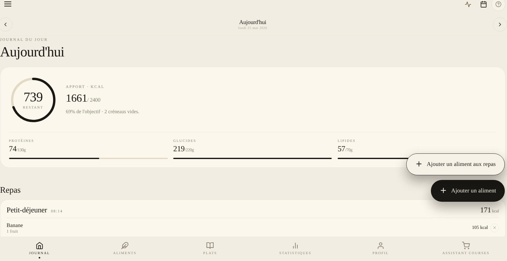
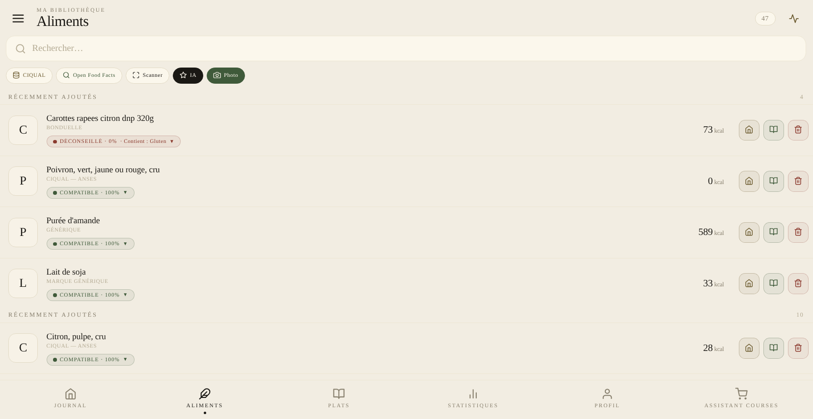
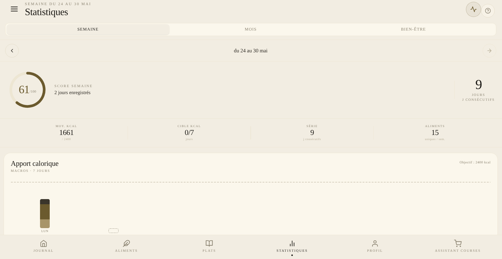
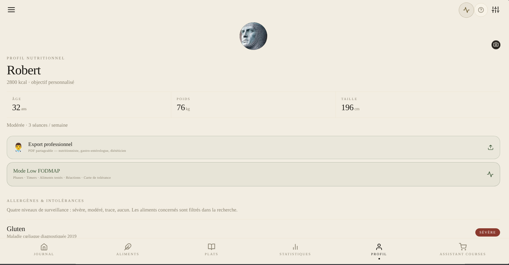
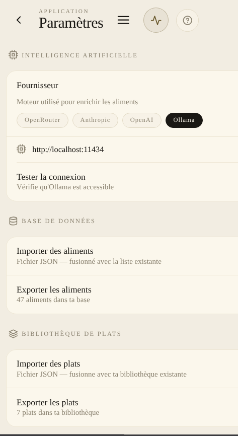

<div align="center">

# 🥗 Nutritor

### Votre assistant nutritionnel intelligent & digestif

*Comprendre ce que vous mangez. Manger ce qui vous convient.*

[](.)
[](.)
[](.)
[](https://github.com/nouhailler/nutritor/releases/latest)

</div>

---

## 🌿 C'est quoi Nutritor ?

Nutritor n'est **pas** une appli de régime ou de comptage de calories.

C'est un **compagnon de connaissance nutritionnelle** — conçu pour les personnes qui veulent comprendre ce qu'elles mangent, gérer des intolérances alimentaires, et décoder les réactions de leur corps.

> *Pour les profils avec SII, FODMAP, sans gluten, sans lactose, ou simplement curieux de leur physiologie digestive.*

---


## 📸 Aperçu

<div align="center">

| Journal du jour | Bibliothèque Aliments |
|:-:|:-:|
|  |  |

| Statistiques | Profil & Allergènes |
|:-:|:-:|
|  |  |

| Paramètres IA |
|:-:|
|  |

</div>

---
## 🎬 Démo

<div align="center">

*Journal · Aliments · Timeline physiologique · Scanner · Profil*


</div>

---

## 🎯 Pour qui ?

| Profil | Ce que Nutritor apporte |
|--------|------------------------|
| 🤕 **Syndrome de l'intestin irritable** | Protocole FODMAP personnel, suivi des réintroductions, détection des aliments déclencheurs |
| 🌾 **Intolérance au gluten / lactose** | 14 allergènes avec niveaux de sévérité, filtrage en temps réel |
| 🏃 **Performance sportive** | Fenêtre anabolique sur la timeline, suivi protéines, générateur de repas adapté |
| 🧬 **Curieux de nutrition** | Encyclopédie de 87 entrées (vitamines, acides aminés, bioactifs), laboratoire nutritionnel IA |
| 🍽️ **Cuisine du quotidien** | Base CIQUAL 2020 (3 167 aliments), Open Food Facts (3 M+ produits), scanner code-barres |

---

## ✨ Fonctionnalités clés

### 📊 Journal nutritionnel intelligent
- **5 repas par jour** avec reset quotidien automatique
- **Anneau kalories** animé avec répartition P/G/L en temps réel
- **Timeline physiologique interactive** — chaque événement (pic glycémique, digestion lente, fermentation FODMAP…) est cliquable et ouvre une fiche détaillée avec mécanisme, durée, impact et recommandation personnalisée
- **Avis nutritionnel IA** quotidien — analyse des équilibres P/G/L et conseils en 2–3 phrases
- **Widget symptômes** — noter fatigue, ballonnements, énergie, transit en quelques secondes

### 🤖 Intelligence artificielle intégrée
- **Enrichissement de fiches nutritionnelles** — l'IA complète automatiquement acides aminés, FODMAP, vitamines, bioactifs depuis le nom de l'aliment
- **Générateur de repas** — recettes IA adaptées à votre profil (allergènes, FODMAP, objectifs macro)
- **Cuisine IA** — 4 modes de génération : par ingrédients, par profil, par critères, ou variante d'un plat existant ; analyse FODMAP/glycémie/digestion/satiété + timeline physiologique
- **Reconnaissance photo** — photographier un aliment pour l'identifier et créer sa fiche
- **Mémoire digestive** — l'IA croise 21 jours de repas × symptômes pour révéler vos patterns d'intolérance personnels
- **Laboratoire nutritionnel** — 7 scores experts (ratio ω-3/ω-6, densité micronutritionnelle, score inflammatoire, NOVA…)
- **Export professionnel** — rapport HTML partageable (nutritionniste, gastro-entérologue, diététicien) avec anthropométrie, allergènes, protocole FODMAP, bilan 30 jours, corrélations aliment→symptôme (moteur automatique), résultats biologiques et médicaments
- **Corrélations aliment → symptômes** — moteur automatique sur 30 jours : 10 facteurs alimentaires (Polyols, Fructanes, Lactose, Gluten, Histamine…) × 6 métriques (douleurs, ballonnements, énergie, transit, sommeil, inflammation), avec détection de l'effet retard (J+1)

### 🔬 Fiches aliments ultra-détaillées
- Profil d'acides aminés complet (18 acides aminés)
- Types d'acides gras (saturés, insaturés, oméga-3/6)
- 13 vitamines essentielles avec rôles physiologiques
- Seuils FODMAP par phase (Monash)
- Molécules bioactives et action métabolique
- Profil sensoriel
- **Bouton ⚡IA** pour enrichir n'importe quelle fiche en un tap

### 🛒 Assistant de courses
- **Scanner de codes-barres** — analyse instantanée de compatibilité personnalisée
- **Score de compatibilité** (0–100) basé sur vos sensibilités digestives
- **Liste de courses** — sauvegarder les produits validés, les importer dans votre base Nutritor
- Détection ultra-transformés, additifs, FODMAP

### 📚 Encyclopédie nutritionnelle hors-ligne
- 87 entrées : vitamines, minéraux, acides aminés, bioactifs, concepts digestifs
- Mode **simple** (grand public) et mode **expert** (clinique)
- **Aucune connexion requise** — 100 % hors-ligne

---

## 📱 Écrans de l'application

<table>
<tr>
<td>

**Onglets principaux**
- 🏠 **Journal** — bilan du jour
- 🌿 **Aliments** — bibliothèque personnelle
- 📖 **Plats** — repas sauvegardés
- 📊 **Stats** — 7 jours, heatmap, corrélations
- 👤 **Profil** — allergènes, régimes, mémoire IA
- 🛒 **Courses** — scanner & liste d'achats

</td>
<td>

**Fonctions avancées**
- 🔍 Recherche multi-sources
- 📷 Photo → aliment (IA vision)
- 🧬 Protocole FODMAP personnel
- 🍽️ Générateur de repas IA
- ✦ Cuisine IA (génération de recettes)
- 📚 Encyclopédie nutritionnelle
- 👨‍⚕️ Export rapport professionnel (HTML/PDF)
- 🔗 Corrélations aliment → symptômes (automatique)
- ⚙️ Config IA (OpenRouter / Ollama / Anthropic / OpenAI)
- 📤 Import / export bibliothèque de plats (JSON)
- 📊 Export CSV journal, symptômes & aliments + import CSV
- ⚖️ Comparateur de produits côte à côte
- 🏅 Nutri-Score Perso (A–E selon votre profil)
- 🙂/🔬 Mode Débutant / Expert (personnalise la profondeur de l'interface)
- 🌐 Interface multilingue (Français / English)

</td>
</tr>
</table>

---

## 🗄️ Sources de données

| Source | Volume | Usage |
|--------|--------|-------|
| 🇫🇷 **CIQUAL 2020** (ANSES) | 3 167 aliments | Base alimentaire française embarquée |
| 🌍 **Open Food Facts** | +3 millions de produits | Recherche & scan code-barres |
| 🤖 **IA** (OpenRouter / Ollama / Anthropic / OpenAI) | Modèles au choix | Génération & enrichissement nutritionnel |
| 📚 **Encyclopédie** | 87 entrées | Statique, 100 % hors-ligne, sans IA |

---

## 🤖 Configurer l'IA

L'IA est **optionnelle** — l'application est pleinement utilisable sans elle. Elle débloque l'enrichissement de fiches, le générateur de repas et la mémoire digestive.

### ☁️ OpenRouter (cloud, recommandé pour débuter)
1. Créer un compte sur [openrouter.ai](https://openrouter.ai)
2. Dans l'app : **Paramètres → OpenRouter**
3. Entrer votre clé API, cliquer **Actualiser** pour charger les modèles gratuits (`:free`)
4. Sélectionner un modèle et enregistrer

### 🧠 Anthropic — Claude
1. Obtenir une clé API sur [console.anthropic.com](https://console.anthropic.com)
2. Dans l'app : **Paramètres → Anthropic**, entrer la clé (`sk-ant-…`)
3. Sélectionner le modèle (Opus 4.7 / Sonnet 4.6 / Haiku 4.5)

### 💬 OpenAI — ChatGPT
1. Obtenir une clé API sur [platform.openai.com](https://platform.openai.com)
2. Dans l'app : **Paramètres → OpenAI**, entrer la clé (`sk-…`)
3. Sélectionner le modèle (GPT-4o / GPT-4o Mini / o1 / o1 Mini)

### 🏠 Ollama (local, 100 % privé)
1. Installer [Ollama](https://ollama.ai) sur votre machine
2. Lancer un modèle : `ollama run llama3.2`
3. Dans l'app : **Paramètres → Ollama**, entrer l'URL locale (ex: `http://192.168.1.x:11434`)
4. Cliquer **Tester la connexion**

> 💡 L'encyclopédie et la base CIQUAL ne requièrent **aucune IA** et fonctionnent entièrement hors-ligne.

---

## 🚀 Lancer le projet (développeurs)

```bash
# Installer les dépendances
npm install

# Démarrer en mode développement
npx expo start

# Scanner le QR code avec Expo Go sur Android ou iOS
```

> **Prérequis :** Node 18+, compte [expo.dev](https://expo.dev), app Expo Go sur le téléphone.

### 📦 Build APK Android

```bash
npm install -g eas-cli
eas login
eas build --platform android --profile preview
```

---

## 🗂️ Architecture technique

```
React Native + Expo SDK 54  ·  TypeScript strict
├── Navigation     AppShell custom (tab + stack, sans React Navigation)
├── Persistance    AsyncStorage via usePersistedState<T>
├── Rendu SVG      react-native-svg (anneau kcal, sparklines)
├── Typographie    Instrument Serif · Geist · JetBrains Mono
├── Icônes         @expo/vector-icons (Feather)
├── IA             OpenRouter · Ollama · Anthropic · OpenAI
├── i18n           i18next · react-i18next (FR / EN)
├── Caméra         expo-camera v17 (scan + photo IA)
└── Build          EAS Build (APK Android)
```

### 🎨 Palette de couleurs

| Token | Couleur | Usage |
|-------|---------|-------|
| `paper` | `#F2EDE2` 🟤 | Fond général (parchemin chaud) |
| `ink` | `#1A1814` ⚫ | Texte principal |
| `ok` | `#3F5A3A` 🟢 | Compatible, succès |
| `warn` | `#8B3A2E` 🔴 | Incompatible, alerte |
| `signal` | `#6B5A2E` 🟡 | Ambre, neutre, CIQUAL |

---

## 📋 Fonctionnalités disponibles

<details>
<summary><strong>📊 Journal & suivi quotidien</strong></summary>

- ✅ Journal avec 5 repas et reset quotidien automatique
- ✅ Duplication automatique de la journée précédente au démarrage
- ✅ Commentaire libre par journée (2 000 caractères max)
- ✅ Avis nutritionnel IA quotidien (P/G/L, conseils persistés par date)
- ✅ Widget symptômes quotidiens (fatigue, ballonnements, énergie…) + durée de sommeil + qualité sommeil (emoji picker)
- ✅ Journal historique 365 jours avec navigation par calendrier
- ✅ Modification des portions dans le journal (+/− 10g, estimation kcal temps réel)

</details>

<details>
<summary><strong>🤖 Intelligence artificielle</strong></summary>

- ✅ Enrichissement IA des fiches aliments (champs manquants uniquement)
- ✅ Bandeau IA avec messages rotatifs contextuels, décompte en secondes, étapes en temps réel
- ✅ Timeout automatique 90s + diagnostic des logs d'enrichissement dans Paramètres
- ✅ Générateur de repas IA profil-aware (allergènes, FODMAP, macros)
- ✅ Reconnaissance photo d'aliments via IA vision
- ✅ Mémoire digestive intelligente (21 jours × symptômes → patterns personnalisés)
- ✅ Laboratoire nutritionnel IA (7 scores experts avec valeur quantitative)
- ✅ Calcul IA des macros sur les plats sauvegardés
- ✅ Commentaire IA sur l'équilibre nutritionnel des plats
- ✅ **Cuisine IA** — génération de recettes personnalisées (4 modes) avec analyse FODMAP/glycémie/digestion/satiété
- ✅ Support Anthropic (Claude) et OpenAI (ChatGPT) en plus d'OpenRouter et Ollama

</details>

<details>
<summary><strong>🛒 Assistant de courses</strong></summary>

- ✅ Scanner code-barres (EAN-13, EAN-8, UPC) avec analyse de compatibilité instantanée
- ✅ Score de compatibilité 0–100 basé sur les sensibilités digestives du profil
- ✅ Fiche produit : verdict, problèmes, points positifs, badge ultra-transformé
- ✅ Historique des scans avec filtres par verdict (compatible / à vérifier / déconseillé)
- ✅ Liste de courses : sauvegarde des produits validés, import dans la base Nutritor

</details>

<details>
<summary><strong>🌿 Aliments & base de données</strong></summary>

- ✅ Bibliothèque personnelle + accès CIQUAL / Open Food Facts / scanner / IA / photo
- ✅ Base CIQUAL 2020 embarquée (3 167 aliments français)
- ✅ Open Food Facts avec scoring de pertinence (exact > marque > préfixe)
- ✅ Saisie libre d'aliment (création manuelle complète sans IA)
- ✅ Bouton ⚡IA dans la fiche aliment pour enrichissement à la demande
- ✅ Import rapide depuis le journal (retour direct sur la fiche détail)
- ✅ **Nutri-Score Perso** — score 0–100 + grade A–E calculé selon votre profil (badge dans la fiche et le comparateur)
- ✅ **Comparateur de produits** — côte à côte : score, macros/100g avec gagnant surligné, FODMAP, allergènes

</details>

<details>
<summary><strong>📊 Timeline physiologique interactive</strong></summary>

- ✅ Événements auto-calculés : pic glycémique, digestion lipidique, fermentation FODMAP, caféine, vigilance, satiété, creux post-prandial, fenêtre anabolique
- ✅ Tap sur chaque événement → fiche détaillée (mécanisme, durée, impact, données utilisées)
- ✅ Personnalisation : note adaptée selon le profil (SII, sensibilités, objectifs)
- ✅ Section "Et si…" — simulation nutritionnelle
- ✅ Mini-métriques cliquables : Énergie / Digestion / FODMAP / Glycémie
- ✅ Saisie de ressentis utilisateur (symptômes horodatés)

</details>

<details>
<summary><strong>👤 Profil & santé digestive</strong></summary>

- ✅ 14 allergènes avec 4 niveaux de sévérité
- ✅ Sensibilités digestives (fructanes, polyols, lactose, histamine, gluten, caféine…)
- ✅ Objectifs santé (digestion, énergie, glycémie, sport, anti-inflammatoire)
- ✅ Tolérances alimentaires (légumineuses, crucifères, alliacées…)
- ✅ Pathologies (SII, reflux, Crohn, RCH, migraine alimentaire)
- ✅ Protocole FODMAP personnel (phases, réintroductions, réactions)
- ✅ Résultats biologiques : saisie manuelle (ferritine, vitamine D, CRP…) avec statut Bas/Normal/Élevé
- ✅ Médicaments en cours (liste texte libre, intégrée dans le rapport professionnel)

</details>

---

## 🎬 Démos interactives

Chaque écran principal dispose d'un bouton **◉** (ambre, topbar) qui lance une démo cinématique en boucle — curseur animé, légendes, phases.

| Écran | Scénario | Durée |
|-------|----------|-------|
| Journal | Recherche → fiche → ajout → timeline → insight IA | ~14 s |
| Aliments | CIQUAL → import → bannière IA → portion → repas | ~14 s |
| Open Food Facts | Catégorie → score → import → édition | ~14 s |
| CIQUAL | Recherche "tomate" → import → fiche détail | ~14 s |
| Scanner | Animation scan EAN-13 → fiche résultat | ~12 s |
| Photo IA | Analyse → 2 cartes résultats → import | ~16 s |
| Plats sauvegardés | Grille → détail → ajout journal | ~12 s |
| Statistiques | Semaine / heatmap mois / corrélations symptômes | ~15 s |
| Profil | Hero / allergènes / laboratoire IA | ~16 s |
| Courses | Historique / fiche produit / liste | ~16 s |
| Générateur de repas | Requête → résultats → détail FODMAP | ~18 s |
| Paramètres | OpenRouter / Ollama / Données | ~16 s |
| Calendrier | Navigation mois, points repas | ~14 s |
| Menu tiroir | Navigation onglets + section IA | ~14 s |
| Encyclopédie | Home / liste / fiche expert | ~16 s |

---

## 🗺️ Prochaines étapes

- [ ] 🌙 Thème sombre
- [ ] 🔔 Rappels de repas (notifications)
- [ ] ☁️ Synchronisation cloud
- [ ] 🍎 Build iOS (TestFlight)
- [ ] 🌿 Données Monash FODMAP officielles

---

## 📜 Sources & licences

| Donnée | Source | Licence |
|--------|--------|---------|
| 🇫🇷 Composition nutritionnelle | [CIQUAL — ANSES](https://ciqual.anses.fr/) | Open data |
| 🌍 Codes-barres & produits | [Open Food Facts](https://world.openfoodfacts.org/) | ODbL |
| 🌿 Seuils FODMAP | [Monash University](https://www.monashfodmap.com/) | Licence commerciale |
| 🧪 ANR vitamines & minéraux | EFSA / ANSES | Réglementation UE |

> Les valeurs nutritionnelles sont **indicatives à des fins de prototype**. Consultez un professionnel de santé pour tout suivi médical.

---

<div align="center">

## 🤝 Contribuer

Nutritor est un projet open source et les contributions sont les bienvenues — que ce soit une correction de bug, une traduction, un test sur ton appareil, ou une idée de fonctionnalité. Consulte le guide de contribution pour savoir par où commencer.

👉 [**CONTRIBUTING.md**](CONTRIBUTING.md)

---

*Fait avec 🌿 pour les estomacs sensibles*

</div>
